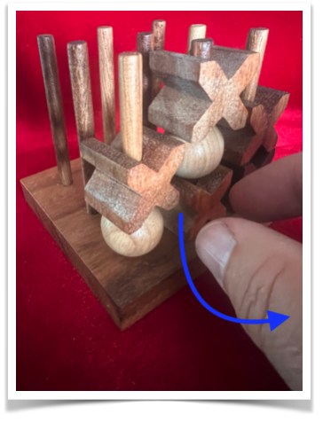

# The strongest player is not the strongest test



*Collapse3 is **not** 3D tic-tac-toe. The 3×3×3 geometry is familiar; the rules and state dynamics are not ([why?](https://github.com/Rob-McCormack/collapse-3/blob/d422b3e/docs/FAQ.md#18-is-collapse3-just-a-more-complicated-version-of-3d-tic-tac-toe)).*

Collapse3 is a small strategy game, solved exactly at low reserve counts, used
here to test an evaluation method against exact ground truth rather than against
intuition or a statistical estimate.

That an evaluation facing only optimal opponents can pass a candidate that is
still a forced loss is not, by itself, news: inspect fewer decisions and you
certify less. What is not obvious is where that threshold sits, or what it costs
to cross it. So this exhibit asks the narrow version of the question, and
answers it exactly:

> **How far must a test opponent be allowed to depart from optimal play before
> passing the test rules out a forced loss?**

**One deliberate mistake per game.** That recovers the entire set of decisions an
unrestricted opponent could reach — at (3,3), (4,4) and (5,5) — and restores
certification at the two sizes where certification is computable.

*Sizes such as (3,3) are reserve counts — beads per player — not board
dimensions.*

This is the two-page exhibit of
[collapse-3](https://github.com/Rob-McCormack/collapse-3), pinned at commit
`d422b3e`. Every number below is produced by the experiments cited; nothing here
is prose-only.

---

## The game, in brief

Collapse3 is played on a 3×3 grid of nine vertical pegs, each holding at most
three beads — 27 cells and **49 winning lines**. You place beads from your
reserve to complete a line of three, and — subject to five legality conditions —
you may destroy one of your opponent's beads, which drops everything above it
and can complete a line for either player. `(4,4)` means four beads per player:
the board never changes size, only the reserves do, and the full game is
`(14,14)`.

At small reserves the game is **solved exactly**, so every move in every
position has a known true value. That is what makes it an instrument: instead of
grading agents against each other, you can grade evaluation methods against
ground truth.

→ [`RULES.md`](RULES.md) — the rules in one page.

## What "certify" means here

An evaluation observes a candidate at some set of positions and pins it to a
reference policy there. Over *every* policy consistent with those observations,
we compute the exact worst case. If a forced loss survives, the evaluation
certified nothing — a passing agent may still be broken, and the evaluation
cannot tell the difference.

---

## Act I — the failure

At (4,4), an evaluation whose opponent always plays optimally inspects **10 of
the 447** candidate decisions that are reachable at all — **2.2%** — and an
agent that passes it perfectly can still be a **certified forced loss**. The
same protocol against an unrestricted opponent inspects all 447 and rules the
loss out. At (4,4) this holds from *both* seats.

More inspection certifies more; that direction is structural. The finding is
*which* protocol falls below the threshold. Restricting the opponent to strong
play — the natural "test against the best bots" choice — is exactly what does
it, because a perfect opponent will not enter an objectively losing line, and
the losing lines are where the weakness lives.

The missed flaw is as small as it can be: **one** non-canonical decision is
enough to make a passing agent force-losable, and that number does not grow
with the board — one at (3,3), one at (4,4), and still one at (5,5)'s 12.7
million states. At (3,3) only the first seat is vulnerable at all; from (4,4)
up both seats are, and both need exactly one.

→ [`results/evaluation_equivalence_latest.json`](https://github.com/Rob-McCormack/collapse-3/blob/d422b3e/results/evaluation_equivalence_latest.json) (Gates A and C)

## Act II — our own fix, falsified

If coverage is the problem, cover more cleverly. We predicted that
strategically chosen coverage would beat coverage chosen at random. It does not.

At (3,3), against depth-matched random coverage drawn from the *same* universe,
strategic coverage buys nothing: wherever strategic certifies, matched random
certifies too — 0 of 30 samples left a forced loss. Random coverage drawn from
the whole state space certifies nothing — 30 of 30. **It is the universe you
draw from, not how cleverly you draw from it.**

Playing more games is no escape either. Also at (3,3): against an opponent that
plays optimally except for a 25% chance of a uniformly random legal move,
roughly **3,000 audited games** are needed to reach the certification that
exhaustive coverage of 96 decisions reaches directly.

→ [`results/evaluation_equivalence_latest.json`](https://github.com/Rob-McCormack/collapse-3/blob/d422b3e/results/evaluation_equivalence_latest.json) (Gates B and D)

## Act III — one deliberate mistake per game

"Let the opponent play anything" is not a protocol anyone can run. So how much
imperfection does an evaluation actually need?

Give the test opponent a **blunder budget**: it plays only value-optimal moves,
except that at most once per game it may play a move that drops the true
win/draw/loss value.

One is enough. At (3,3), (4,4) and (5,5), the one-blunder support is **exactly
equal** to the unrestricted-opponent support — set equality, not approximation.
At (3,3) and (4,4), every cell that certified nothing against a perfect
opponent certifies with that single permitted mistake. At (5,5) the pinned
solve that certification requires is memory-bound across 12.7 million states,
so the exposure half is established there and the certification half is **not
claimed**.

**Why one is enough — and when.** At these reserve counts the opening is a
**draw** under perfect play, and the candidate is pinned to a value-optimal
reference that never hands value back. A single value-losing move therefore
drops the opponent to the bottom of the win/draw/loss ladder, and from there
every move it has left is already value-optimal: once a player has thrown the
game there is nothing left to throw, so a second mistake buys nothing. Those
preconditions are load-bearing, and the experiment tests them rather than
assuming them. Re-rooted at positions that are *not* drawn, the same
measurement finds budgets of **two** — the opponent has two rungs to fall
through instead of one. Equal reserves give a drawn opening only from (1,1)
through (5,5); at (6,6) the first player already wins outright, as they do in
the full (14,14) game, so both sit outside the regime this result describes.

**Read the budget carefully.** This is one deviation followed by *exhaustive*
exploration of everything after it — a structural recipe, not a statistical
one. It is not "add noise to your eval opponent"; the sampled version of this
idea is Act II's 3,000 games. The cheap fix is closure, not randomness.

→ [`results/tremble_budget_latest.json`](https://github.com/Rob-McCormack/collapse-3/blob/d422b3e/results/tremble_budget_latest.json)

---

## Scope — what this does not claim

This is a solved toy game. Nothing here predicts how any real system behaves,
and no result below should be read as an empirical claim about language models,
game engines, or any deployed agent.

What transfers is negative: a class of evaluation protocol that looks rigorous
can be shown, exactly, to rule out less than it appears to. That is knowledge
about methods, not a forecast about systems — and it is only interesting
because the ground truth here is computed rather than estimated.

**The one-blunder result is bounded in three ways.** Certification is verified
at (3,3) and (4,4); at (5,5) only the exposure half is established, because the
pinned solve certification requires is memory-bound across 12.7 million states.
It is stated under win/draw/loss grading — grade the opponent on a finer scale
and a second permitted mistake can be demanded; the main repo dissects one such
case, along with a rule we tried to build on it that turned out to be false at
(4,4), and records both the rule and its refutation. And it holds where the
opening is a draw under perfect play, which for equal reserves means only
through (5,5); at (6,6) the first player wins outright and the result is not
claimed there.

**The counts are properties of a frozen reference policy.** A support set is
the set of decisions one specific candidate is driven through, so figures like
"10" and "447" move when the reference's tie-break changes — we measured that
directly, and 41 becomes 49. Only the patterns are claimed: the set equality,
the budget at which certification flips, and the fact that one mistake
suffices.

**These evaluations observe actions.** Protocols that see only grades, or only
outcomes such as win rate and Elo, observe strictly less. Modelling them by
pinning actions would credit them with information they never had, so they are
left unimplemented rather than approximated.

**This is not a new method.** It is the exact, game-theoretic instance of
surviving-mutant reasoning and identified sets. The contribution is that the
quantity is computed rather than estimated, on a game where that is possible.

## Also in the main repo

- **Elo can rank a certifiably exploitable rulebook above the perfect player it
  never beat.** (Finding 10)
- **A network scoring ~98% on unseen positions can still be a certified forced
  loss.** (Finding 16)
- **Deliberate underperformance is structurally limited**, and outcome audits
  detect thrown value but never thrown intent. (Finding 9)

## Reproduce

Python 3.9+, no runtime dependencies, no GPU. Clone the **main** scientific
repo — this exhibit contains no code.

```bash
git clone https://github.com/Rob-McCormack/collapse-3.git
cd collapse-3
git checkout d422b3e

# the experiments themselves need nothing but the standard library
python -m experiments.evaluation_equivalence 3 4 --full --ga5   # Acts I, II
python -m experiments.tremble_budget 3 --slow --tb5             # Act III

# the guards need pytest
pip install -e ".[dev]"
pytest                            # fast gates
COLLAPSE3_SLOW=1 pytest           # plus the (4,4) re-solves
```

The positional arguments choose the board sizes. `--full` adds Act II's Gates B
and D, `--slow` adds (4,4) to the tremble run, and `--ga5` / `--tb5` add the
(5,5) runs, which solve ~12.7M states and take several minutes each. Every
number above is guarded by a test that fails loudly if the engine or the
reference policy drifts.

## The full work

- [collapse-3](https://github.com/Rob-McCormack/collapse-3) — solver, experiments, provenance records
- [`docs/FINDINGS.md`](https://github.com/Rob-McCormack/collapse-3/blob/d422b3e/docs/FINDINGS.md) — all findings
- [`docs/EVALUATION_EQUIVALENCE.md`](https://github.com/Rob-McCormack/collapse-3/blob/d422b3e/docs/EVALUATION_EQUIVALENCE.md) — Acts I and II in full
- [`docs/BEAT_THE_BEST.md`](https://github.com/Rob-McCormack/collapse-3/blob/d422b3e/docs/BEAT_THE_BEST.md) — plain-language on-ramp
- [`results/`](https://github.com/Rob-McCormack/collapse-3/tree/d422b3e/results) — provenance-stamped records behind every number

## License

MIT — see [LICENSE](LICENSE).
